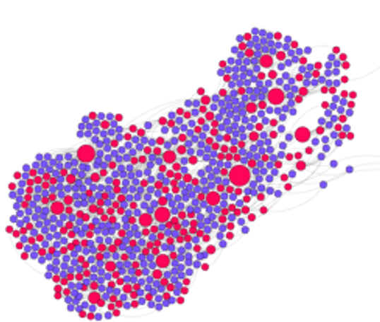
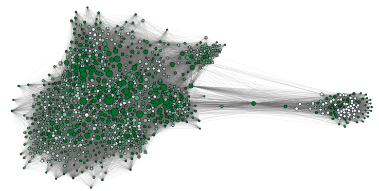
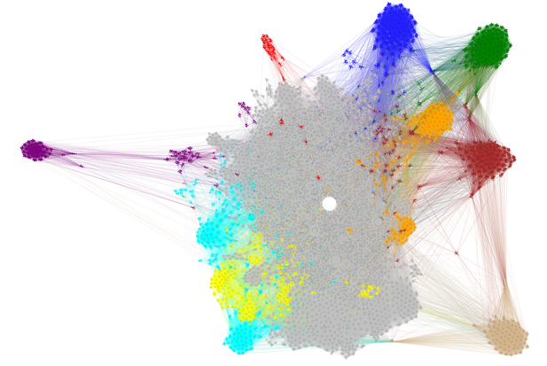
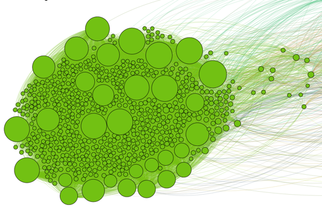
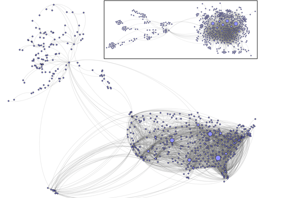
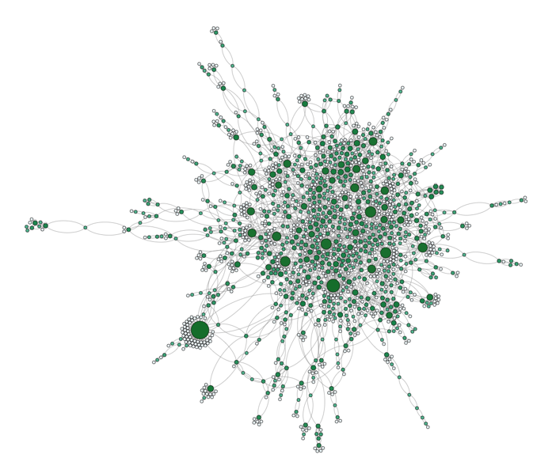
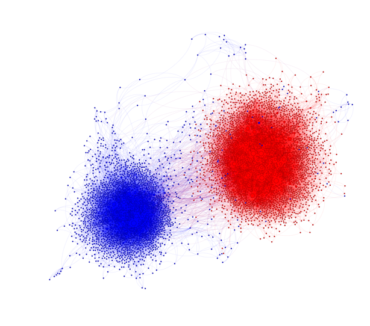
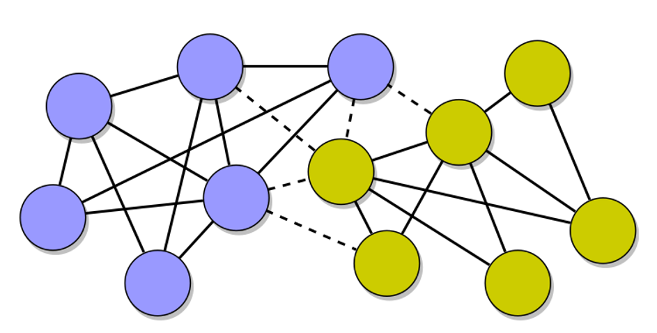

|<b>Profesor</b>    |   |
|:-:|:-:|
|    <b>[Alfonso Meléndez](http://profesores.is.escuelaing.edu.co/~amelendez/HojaDeVida/HojaDeVida.html)</b>   | **[Maestría en Ciencia de Datos](http://ds.sbu.ac.ir/)**       **[Escuela Col de Ingeniería Bogotá, Colombia](http://www.escuelaing.edu.co)**      <b> Segundo Semestre de  2023</b> |

# 🌐 Capítulo 1 ¿Qué es la Ciencia de redes?

https://github.com/jamelende/LibroCienciaDeRedes/blob/main/Videos/VideoRedAleatoria.mp4

https://github.com/jamelende/LibroCienciaDeRedes/assets/55796430/8568ca9b-e028-496f-8608-38379584735e

# 🌐 Capítulo 2  Conceptos Básicos de Grafos

# 🌐 Capítulo 3 Medidas Locales y Globales de una Red

# 🌐 Capítulo 4 Modelos de redes

# 🌐 Capítulo 5 Difusión en Redes

# 🌐 Capítulo 6 Las redes y su Vulnerabilidad

# 🌐 Capítulo 7 Redes Dinámicas

# 🌐 Capítulo 8 Aprendizaje Automático usando redes (Graph machine learning)

    
De las ramas de la inteligencia artificial, el aprendizaje automático  (Machine L earning)es una que ha atraído
la mayor atención en los últimos años. Se refiere a una clase de algoritmos informáticos que
aprenden y mejoran automáticamente sus habilidades a través de la experiencia sin ser explícitamente
programados. 
Este enfoque se inspira en la naturaleza. Imaginemos un atleta que se enfrenta por primera vez a un
movimiento novedoso: empieza lentamente, imitando cuidadosamente el gesto
de un entrenador, intentar, cometer errores y volver a intentarlo. Con el tiempo mejorarán,
cada vez más confiado.
Ahora bien, ¿cómo se traslada este concepto a las máquinas? Es esencialmente un problema  de optimización.
El objetivo es encontrar un modelo matemático que sea capaz de lograr la mejorposible desempeño en una tarea particular.
El rendimiento se puede medir utilizando un parámetro específico ó métrica de rendimiento 
(también conocida como función de pérdida o función de costo). El algoritmo utiliza
estos datos para tomar decisiones o predicciones de forma iterativa para la tarea específica. En cada iteración,
Las decisiones se evalúan utilizando la función de pérdida. El error resultante se utiliza para actualizar el
parámetros del modelo de una manera que, con suerte, signifique que el modelo funcionará mejor. Este
 proceso se llama comúnmente entrenamiento.

# 🌐 Apéndice: Recursos

### Libros
- [Graph Representation Learning](https://www.cs.mcgill.ca/~wlh/grl_book/) by William L. Hamilton
- [Network Science](http://networksciencebook.com/) by Albert-László Barabási
- [Networks, Crowds, and Markets: Reasoning About a Highly Connected World](https://www.cs.cornell.edu/home/kleinber/networks-book/) by David Easley and Jon Kleinberg
- [Analysis of Biological Networks](https://onlinelibrary.wiley.com/doi/book/10.1002/9780470253489), 2007.

###  Herramientas de Aprendizaje
- [DGL (Deep Graph Library)](https://www.dgl.ai/)
- [PyG (PyTorch Geometric)](https://www.pyg.org/)
- [NetworkX](https://networkx.org/)

### Cursos
- [CS224W: Machine Learning with Graphs](http://web.stanford.edu/class/cs224w/) by Jure Leskovec

### Tips y herramientas para Cienccia de datos

- [Fundamental and Useful Tools and Tips for Data Science](https://github.com/zahta/tools_tips_data_science)
- [Essential Steps to Set Up Your PC for Graph Machine Learning with PyG](https://github.com/zahta/graph_ml/tree/main/setup_pc_for_coding_gml)
